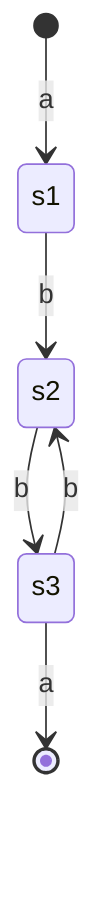
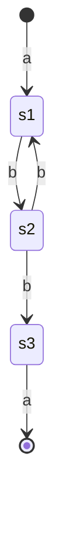
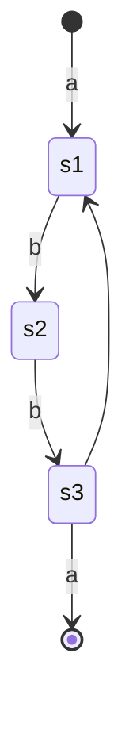

# 正则表达式定义

什么是正则表达式？

**正则表达式**（英语：Regular Expression，常简写为regex、regexp或RE），又称**正则表示式**、**正则表示法**、**规则表达式**、**常规表示法**。

它是一个字符串，可以用来描述、匹配一系列匹配某个句法规则的字符串。他描述的是一种正则文法，是一种上下文无关的文法。


例如： a\*bc\* 这样一个正则表达式可以匹配的是下面一些字符串:

b

ab

abc

aabc

aabcc

........

满足正则表达式的字符串是一系列满足文法规则的字符串集合。


# 正则表达式的用途

大体上正则表达式有四类用途：

- 匹配查找
例如服务器出现故障的时候，我们需要从服务器的日志文件里面找出符合要求的相关事件信息 event1, event2，我们经常会使用 notepad++ 结合 正则表达式 `event1|event2`，把相关的事件都找出来，然后再做分析。

- 替换
在编写代码过程中，想要把所有的Size变量名都替换为iSize, 但是又不想修改像WindowSize 这样的变量名。 我们经常会使用 `\bSize\b` 来表达找到前后都是空白符的Size

- 分割
找到日志中的日期，并且将其中的月份和日期打印出来，我们可以使用正则表达式的捕获分组功能来完成 `(\d{4})-(\d{2})-(\d{2})`

- 验证
网页前端需要校验用户输入的邮箱地址是否符合要求，可以使用`^([a-zA-Z0-9._%-]+@[a-zA-Z0-9.-]+\.[a-zA-Z]{2,4})*$` 来提示用户输入是否正确。

# 正则表达式的内容

## 概述

正则表达式是一门语言，语言是由基本语法单元组成。正则表达式的基本单元主要包括下面几类：

字符、字符组、量词、分组、断言组成。

## 字符

字符区分为普通字符和元字符。

### 元字符

元字符就像是一门语言的语言关键字一样，他是有特殊含义的，只不过在正则语言里面的关键字是一些字符。元字符主要包括下面这些

| 元字符 | 描述                                                         |
| ------ | ------------------------------------------------------------ |
| .      | 句号匹配任意单个字符除了换行符。                             |
| [ ]    | 字符集。匹配方括号内的任意字符。                             |
| [^ ]   | 否定的字符组。匹配除了方括号里的任意字符                     |
| *      | 匹配>=0个重复的在*号之前的字符。                             |
| +      | 匹配>=1个重复的+号前的字符。                                 |
| ?      | 标记?之前的字符为可选.                                       |
| {n,m}  | 匹配num个大括号之前的字符或字符集 (n <= num <= m).           |
| (xyz)  | 字符分组，匹配与 xyz 完全相等的字符串.                       |
| \|     | 多选结构，匹配符号前或后的子表达式.                          |
| \      | 转义字符,用于匹配一些保留的字符 `[ ] ( ) { } . * + ? ^ $ \ |` |
| ^      | 从开始行开始匹配.                                            |
| $      | 从末端开始匹配.                                              |


### 普通字符

所有的除了元字符以外的字符，可以称之为普通字符。例如数字：0-9，字母：a-z, A-Z , 符号：+ 等

当我们使用例如 `abc`  这样一个正则表达式的时候，正则表达式引擎一般是按照`a->b->c->匹配`这样一个单字符比较的方式来匹配的。

## 字符组

实际使用中字符组是最常用的语法结构之一。字符组就是一组字符。它表示的是在一个位置可以出现的各种字符，写法就是在`[` 和`]` 之间列出所有可能出现的字符，例如`[abc]` ，`[314]`,  `[#.?]` 。

如果想要表示所有数字字符： `[0123456789]`

想要表示所有的小写字母: `[abcdefqhijklmnopqrstuvwxyz]`

需要注意的是：如果[]里面包含空格，那空格也是可选的字符之一

### 范围表示法

范围表示法就是使用 `[x-y]` 这种形式表示x到y的整个范围内的字符。范围表示法一般是根据字符对应的ascii 码值来确定的，ascii码值小的要放在前面。

例如：

 `[0123456789]` --> `[0-9]`

`[abcdefqhijklmnopqrstuvwxyz]` --> `[a-z]`

注意：使用`[0-z]`这样的范围表示是合法的，但是他的范围很难一眼看出来。实际上从ascii码可以知道他表示的不仅仅包括数字、小写字母，还包括大写字母和其他的标点符号。

### 排除型字符组

在`[]` 里面`[` 紧跟着`^` 就是排除型字符组，表示匹配一个没有来的字符。需要注意的是排除型字符组必须要匹配一个字符。

例如：

[^0-9] 表示 0-9之外的字符，也就是非数字字符。

`[^0-9][0-9]` 表示的是首个字符是非数字，第二个字符是数字。

`89` 不满足这个正则表达式， `a8`则满足


### 字符组简记法

对于[0-9] [a-z] 等这样的常用字符组，正则表达式提供了简写的表达，例如我们可以使用：

\d 表达`[0-9]`，其中的 d 代表"数字 (digit) "; 

\w 表达 `[0-9a-zA-Z_]` ，其中的 w 代表"单词字符 (word) ";

\s 表达`[ \t\r\n\v\f]` (中括号里面第一个字符是空格)， s 表示"空白字符(space)"  


字符组简记法

| `\b`  | 匹配一个单词边界，也就是指单词和非字母字符间的位置。例如，“`er\b`”可以匹配“`never`”中的“`er`”，但不能匹配“`verb`”中的“`er`”。 |
| :---: | ------------------------------------------------------------ |
| `\B`  | 匹配非单词边界。“`er\B`”能匹配“`verb`”中的“`er`”，但不能匹配“`never`”中的“`er`”。 |
| `\cx` | 匹配由x指明的控制字符control + x。x的值必须为`A-Z`或`a-z`之一。否则，将c视为一个原义的“`c`”字符。 |
| `\d`  | 匹配一个数字字符。等价于[0-9]。                              |
| `\D`  | 匹配一个非数字字符。等价于`[^0-9]`。                         |
| `\f`  | 匹配一个换页符。等价于\x0c和\cL。                            |
| `\n`  | 匹配一个换行符。等价于\x0a和\cJ。                            |
| `\r`  | 匹配一个回车符。等价于\x0d和\cM。                            |
| `\s`  | 匹配任何空白字符，包括空格、制表符、换页符等等。等价于`[ \f\n\r\t\v]`。 |
| `\S`  | 匹配任何非空白字符。等价于`[^ \f\n\r\t\v]`。                 |
| `\t`  | 匹配一个制表符。等价于\x09和\cI。                            |
| `\v`  | 匹配一个垂直制表符。等价于\x0b和\cK。                        |
| `\w`  | 匹配包括下划线的任何单词字符。等价于“`[A-Za-z0-9_]`”。       |
| `\W`  | 匹配任何非单词字符。等价于“`[^A-Za-z0-9_]`”。                |


### 字符转义

如果我们想要在字符组里面使用`-`,`^`，`[]` 这样的元字符怎么办？

答案是使用转义符号`\`,  例如[a\\-c]  表示的是 `a - c` 这三个字符, `[\^ab]` 代表的是`^ab` 三个字符， `[\[\]cz]` 带包的是`[]az`四个字符

对于`-` 来说还可以将`-` 放在中括号最前面来表示。例如`[-ab]` 代表匹配的是 `- a b` 这三个字符


需要注意的是：很多语言本身就支持转义字符，所以要想传给正则表达式引擎合适的转义字符，通常需要使用raw string 避免转义. 例如python 可以使用 r"^[0\\-9]$"   它等价于 "^[0\\\\-9]$". 其它不支持raw string 就需要用双重转义。

```python
text = r'C:\Windows\System32\new'
patstr = r'[\\n]' # 或者 '[\\\\n]'
pattern = re.compile(patstr)
matches = pattern.finditer(text)
for i in matches:
    print(i.group())
"""
\
n
\
\
n
"""
```


## 量词

### 概述

量词可以用来表达前面的字符结构需要重复多次。

例如，我们的手机号码一般是11位数字，我们可以使用`\d\d\d\d\d\d\d\d\d\d\d` 来表达，但是使用量词表达11位数字可以更简洁和直观：`\d{11}`   （注：实际手机号码是有合法号段的）


### 量词格式

量词一般可以按照如下的格式来写

| 量词 | 说明 |
| ---- | ---- |
|{n} | 之前的元素必须出现 n 次|
|{m,n} | 之前的元素最少出现 m 次，最多出现 n 次 |
|{m,} |之前的元素至少出现 m 次，出现次数无上限|
|{0, n} | 之前的元素可以不出现，也可以出现，最多出现 n 次〈在某些语言中可以写为{， n})  |

### 常用量词

{m,n} 是通用形式的量词，正则表达式还有三个常用量词，分别是`*`, `+`, `?`·它们的形态虽
然不同于{m,n}, 但是功能相同 。

常用量词

| 常用量词 | {m，n}等价形式 | 说明                                     |
| -------- | -------------- | ---------------------------------------- |
| *        | {0,}           | 可能出现，也可能不出现，出现次数没有上限 |
| +        | {1,}           | 至少出现 1次，出现次数没有上限           |
| ?        | {0,1}          | 至多出现 1次，也可能不出现               |

 

- 注意量词前面可以跟单个字符、字符组、分组, 表达的含义是不一样的

例如：

 `abc{2}`  匹配的字符串是abcc

`[abc]{2}`匹配的字符串是aa, bb, cc

`(abc){2}`匹配的字符串是abcabc


## 分组


### 概述

分组是将正则表达式拆分为多个不同的部分，每个部分使用`()` 括起来表示是一个分组。分组主要的作用有下面几个：

- 将某些部分描述为分组，然后对分组运用量词，可以实现描述重复某个模式的字符串的功能。
- 利用分组和`|`形成多选结构

- 引用分组
- 利用分组分割


### 分组重复    

例如，`(AT){3,10}` 用来描述 AT 重复3次到10次的序列，如ATATAT, ATATATAT，.......


### 分组多选结构

使用| 可以表达多个正则项里面匹配一个，一般`|`需要和`()`一起使用，表示分组里面的每一个项是可选的

例如 `^(From|To|Mail).*` 可以用来匹配 From、To、Mail开头的行


### 引用分组

使用括号不仅可以将有联系的元素归拢起来并分组，正则表达式还可以保存`()`分组匹配的文本，在正则表达式后面通过\groupnum来引用。

例如 `<title>.*</title>` 可以用来描述html里面的title 标签。 通过引用分组 `<(title)>.*</\1>`  更加简洁；

例如 使用`<([a-zA-Z0-9]+) (\s[^>]+)?>[\s\S]*?</\1>`   可以匹配所有合法的html标签

注意：分组的编号是按照左括号出现的顺序来计数的。

例如：`(((\d{4})-(\d{2}))-(\d{2})))  `

编号 :   123              4                 5


### 分组分割

例如，分割邮箱地址里面的id和服务商


```python
mail = 'zch921005@126.com'
regex = '(\w{4,20})@(126|qq|gmail|163|outlook)\.(com)'
print(re.match(regex, mail).group(1))
'zch921005'
print(re.match(regex, mail).group(2))
'126'

```

 

### 非捕获分组

​        对于正则表达式引擎来说，只要出现了括号，他都会将这个分组记录下来，但是如果不需要引用，保存这些分组必然会影响匹配执行的性能。所以正则表达式提供了一种方法来表示不需要捕获该分组: (?:....) 在括号的前面加上?:。

需要注意的是：如果使用了非捕获分组，注意分组编号是会忽略非捕获分组的。

例子 `(?:\d{4})-(\d{2})-(\d{2})   ` 第一个捕获分组对应的是月份。


## 断言

正则表达式中有一些结构并不是用于匹配文本，而是用于判断文本是否处于特点的位置。常用的断言包括：单词边界、行起始和结束位置。

### 边界断言

单词边界：`\b`

行起始位置：`^`

行结束位置: `$`

### 环视（lookaround）

环视是在当前位置看看左边或者右边的字符串是否满足条件，它并不匹配实际的字符串。

例如：


| 符号 | 描述         | 判断方向 | 匹配成功返回值 |
| ---- | ------------ | -------- | -------------- |
| ?=   | 肯定顺序环视 | 右边     | True           |
| ?!   | 否定顺序环视 | 右边     | False          |
| ?<=  | 肯定逆序环视 | 左边     | True           |
| ?<!  | 否定逆序环视 | 左边     | False          |

- 肯定顺序环视

正则表达式：`"(T|t)he(?=\sfat)"`

**The** fat cat sat on the mat.

- 否定顺序环视

正则表达式：`(T|t)he(?!\sfat)`

The fat cat sat on **the** mat.

- 肯定逆序环视

正则表达式：`(?<=(T|t)he\s)(fat|mat)`

The **fat** cat sat on the **mat**.

- 否定逆序环视

正则表达式：`(?<!(T|t)he\s)(cat)`

The cat sat on **cat**。


# 常用正则表达式举例


```
字母数字字符：^[a-zA-Z0-9]*$
带空格的字母数字字符：^[a-zA-Z0-9 ]*$
密码：^(?=^.{6,}$)((?=.*[A-Za-z0-9])(?=.*[A-Z])(?=.*[a-z]))^.*$
电子邮件：\b[A-Z0-9._%+-]+@[A-Z0-9.-]+\.[A-Z]{2,}\b
IPv4 地址：^((?:(?:25[0-5]|2[0-4][0-9]|[01]?[0-9][0-9]?)\.){3}(?:25[0-5]|2[0-4][0-9]|[01]?[0-9][0-9]?))*$
小写字母：^([a-z])*$
大写字母：^([A-Z])*$
网址：\b(https?|ftp|file)://[-A-Z0-9+&@#/%?=~_|$!:,.;]*[A-Z0-9+&@#/%=~_|$]
日期（MM/DD/YYYY）：^(0?[1-9]|1[012])[- /.](0?[1-9]|[12][0-9]|3[01])[- /.](19|20)?[0-9]{2}$
日期（YYYY/MM/DD）：^(19|20)?[0-9]{2}[- /.](0?[1-9]|1[012])[- /.](0?[1-9]|[12][0-9]|3[01])$
```


# 正则表达式的原理

正则表达式所使用的理论模型是有穷自动机，其具体实现称为正则引擎 (Regex Engine) 。用正则表达式处理字符串，首先需要生成自动机〈很多语言中使用正则表达式之前都要"编译"正则对象);之后，无论输入什么字符串，正则引擎都只需要老老实实地在状态之间游走。  

有穷自动机由有限个状态和状态之间转移和动作组成。

## 正则表达式匹配过程

正则表达式引擎的实现方式有DFA和NFA两种类型。

- 确定性有穷自动机（DFA）

确定性有穷状态机任意一时刻都处于确定的状态。

下面是 正则表达式`a(bb)+a`  对应的确定性有穷状态机的图示。





- 非确定性有穷自动机 (NFA)

非确定性有穷自动机的在某些时刻处于的状态是不确定的

正则表达式`a(bb)+a`  对应的非确定性状态机如下：

NFA1



NFA2




从上面图可以知道，DFA对于每个字符只要匹配一次，所以一般来说DFA性能要更优；但是DFA所能表达的特性要少于NFA。所以大多数应用语言采用的是NFA。

各种语言的正则引擎类型

| 引擎类型 | 语言                                                         |
| -------- | ------------------------------------------------------------ |
| DFA      | awk (大多数版本〉、 egrep(大多数版本)、flex、 lex、 MySQL、Procmail |
| NFA      | GNUEmacs 、 Java、 grep 、 less、 more 、 .NET 、 P归bon 、 Ruby 、 PHP 、 sed |


## 回溯

NFA在某些时刻的状态是不确定的，NFA引擎在有多个状态的时候，会先记录下这些状态备用，然后才会选择某个状态尝试，如果尝试失败，再回退回去。

例如对于 `".*"` 这个正则表达式

对于`"aaaa" deeadd` 这个字符串，NFA 引擎会先匹配到字符串末尾，但是发现末尾没有`"`则会一直回退，知道能够匹配。最后才能匹配`"aaaa"`

所以对于`"aaaa" dddd"`  最终匹配的是整个字符串 `"aaaa" dddd"`


标准匹配量词（?、*、+，以及{min,max}）都是“匹配优先”的。

如果需要忽略优先，则需要在对应后面加上一个问号`?`

例如如果使用 `".*?"` 则可以匹配到 `"aaaa"` 这个字符串

| 匹配优先量词 | 忽略优先量词 | 限定次数                                 |
| ------------ | ------------ | ---------------------------------------- |
| *            | *?           | 可能不出现，也可能出现，出现次数没有上限 |
| +            | +?           | 至少出现1次，出现次数没有上限            |
| ?            | ??           | 至多出现1次，也可能不出现                |
| {m,n}        | {m,n}?       | 出现次数最少为m次，最多为n次             |
| {m,}         | {m,}?        | 出现次数最少为m次，没有上限              |
| {,n}         | {,n}?        | 可能不出现，也可能出现，最多出现n次      |


# 工具推荐

regexbuddy


# 参考

《精通正则表达式》

《正则指引》

https://github.com/ziishaned/learn-regex/blob/master/translations/README-cn.md

维基百科

